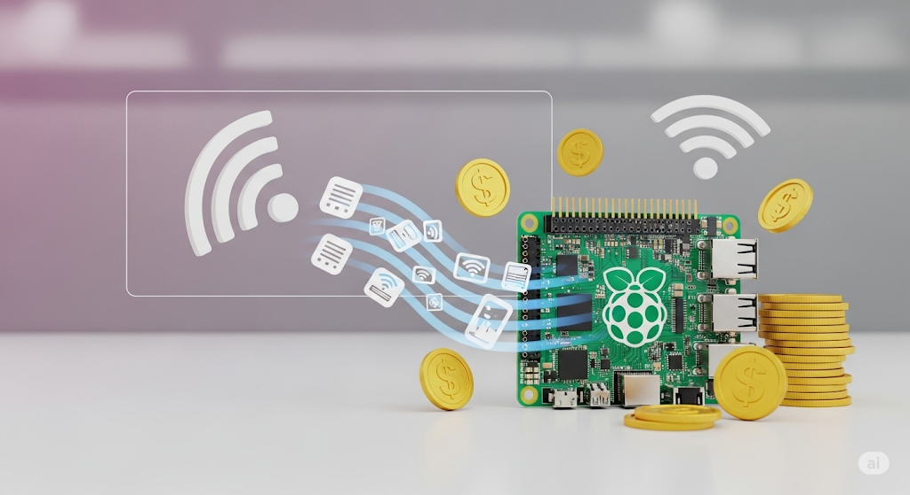

# 💰 Pi Passive Earnings - Docker Edition



🚀 **Transform your Raspberry Pi into a passive income machine**
This repository contains Docker configurations to run multiple passive earning applications on your Raspberry Pi or any Linux system.

## 📋 Table of Contents

- [💰 Pi Passive Earnings - Docker Edition](#-pi-passive-earnings---docker-edition)
  - [📋 Table of Contents](#-table-of-contents)
  - [🌟 What's Included](#-whats-included)
  - [💸 Earning Potential](#-earning-potential)
  - [📋 Prerequisites](#-prerequisites)
  - [🐳 Docker Installation](#-docker-installation)
  - [⚙️ Setup Instructions](#️-setup-instructions)
  - [🚀 Running the Services](#-running-the-services)
  - [📊 Monitoring Your Earnings](#-monitoring-your-earnings)
  - [🔧 Troubleshooting](#-troubleshooting)
  - [⚠️ Important Notes](#️-important-notes)
  - [🤝 Contributing](#-contributing)
  - [📄 License](#-license)

## 🌟 What's Included

This repository includes Docker configurations for seven popular passive earning platforms:

| Service | Description | 🔗 Sign Up Link |
|---------|-------------|------------------|
| 🍯 **Honeygain** | Share your unused internet bandwidth and earn money | [Join Honeygain](https://r.honeygain.me/81E75AD93E) |
| ♟️ **Pawns.app** | Monetize your internet connection through IPRoyal's network | [Join Pawns.app](https://pawns.app/?r=14794322) |
| 📦 **PacketShare** | Earn by sharing your internet bandwidth | [Join PacketShare](https://www.packetshare.io/?code=B9145C90A9403C82) |
| 🚦 **TraffMonetizer** | Earn by sharing your internet traffic | [Join TraffMonetizer](https://traffmonetizer.com/?aff=1908800) |
| 📻 **EarnFM** | Earn by sharing your internet bandwidth | [Join EarnFM](https://earn.fm/ref/PX1W89FS) |
| 🟡 **BitPing** | Network latency testing and monitoring service | [Join BitPing](https://app.bitping.com/dashboard) |
| 🟢 **GaGaNode** | Decentralized residential proxy network | [Join GaGaNode](https://dashboard.gaganode.com/register) |

## 💸 Earning Potential

💡 **Realistic Expectations**: Passive earning apps typically generate **$5-30 per month** depending on:
- 🌐 Your internet speed and stability
- 📍 Geographic location (US/EU locations generally earn more)
- ⏰ Uptime (24/7 operation recommended)
- 📊 Network demand in your area

## 📋 Prerequisites

Before getting started, ensure you have:

- 🖥️ Raspberry Pi (3B+ or newer) or any Linux system
- 🌐 Stable internet connection
- 🐳 Docker and Docker Compose installed
- 📧 Accounts on the earning platforms (use referral links above!)

## 🐳 Docker Installation

If you don't have Docker installed yet, follow this comprehensive guide:

👉 **[Docker Installation Guide](https://github.com/devidence-dev/pi-home-server?tab=readme-ov-file#docker-installation-whale)**

## ⚙️ Setup Instructions

### 1️⃣ Clone the Repository

```bash
git clone https://github.com/YOUR_USERNAME/pi-passive-earns.git
cd pi-passive-earns
```

### 2️⃣ Create Environment Files

Each service requires a `.env` file with your credentials. Here's an example with Honeygain:

#### 🍯 Honeygain Setup Example
```bash
cd honeygain
cp .env.example .env
nano .env
```

Add your Honeygain credentials:
```env
HONEYGAIN_EMAIL=your-email@example.com
HONEYGAIN_PASSWORD=your-password
HONEYGAIN_DEVICE_NAME=RaspberryPi-Honeygain
```

#### 📝 Other Services
For **Pawns.app**, **PacketShare**, **TraffMonetizer**, **EarnFM**, **BitPing**, and **GaGaNode**, follow the same process:
1. Navigate to the service folder
2. Copy `.env.example` to `.env`
3. Fill in your credentials in the `.env` file

## 🚀 Running the Services

### Start All Services
```bash
# From the root directory
docker-compose -f honeygain/docker-compose.yml up -d
docker-compose -f pawns-app/docker-compose.yml up -d
docker-compose -f packetshare/docker-compose.yml up -d
docker-compose -f traffmonetizer/docker-compose.yml up -d
docker-compose -f earnfm/docker-compose.yml up -d
docker-compose -f bitping/docker-compose.yml up -d
docker-compose -f gaganode/docker-compose.yml up -d
```

### Start Individual Services
```bash
# Honeygain only
cd honeygain && docker-compose up -d

# Pawns.app only
cd pawns-app && docker-compose up -d

# PacketShare only
cd packetshare && docker-compose up -d

# TraffMonetizer only
cd traffmonetizer && docker-compose up -d

# EarnFM only
cd earnfm && docker-compose up -d

# BitPing only
cd bitping && docker-compose up -d

# GaGaNode only
cd gaganode && docker-compose up -d --build
```

### Check Service Status
```bash
docker ps
```

### View Logs
```bash
# View logs for specific service
docker logs honeygain-app
docker logs pawns-app-container
docker logs packetshare-container
docker logs traffmonetizer-container
docker logs earnfm-client
docker logs bitping-container
docker logs gaganode-container

# Follow logs in real-time
docker logs -f honeygain-app
```

## 📊 Monitoring Your Earnings

Log into each platform's dashboard to monitor your earnings:

- 🍯 **Honeygain**: [Dashboard](https://dashboard.honeygain.com/)
- ♟️ **Pawns.app**: [Dashboard](https://pawns.app/dashboard)
- � **PacketShare**: [Dashboard](https://www.packetshare.io/dashboard)
- �🚦 **TraffMonetizer**: [Dashboard](https://traffmonetizer.com/dashboard)

## 🔧 Troubleshooting

### Common Issues

#### 🔴 Service Won't Start
```bash
# Check logs for errors
docker logs [container-name]

# Restart service
docker-compose restart
```

#### 🔴 Connection Issues
- ✅ Verify your credentials in `.env` files
- ✅ Check internet connectivity
- ✅ Ensure firewall isn't blocking connections

#### 🔴 Low Earnings
- ✅ Ensure 24/7 uptime
- ✅ Check if your IP is residential (not VPN/proxy)
- ✅ Consider geographic limitations

### Useful Commands
```bash
# Stop all services
docker stop $(docker ps -aq)

# Remove all containers
docker rm $(docker ps -aq)

# View system resources
docker stats

# Update images
docker-compose pull && docker-compose up -d
```

## ⚠️ Important Notes

- 🔐 **Security**: Never commit `.env` files to version control
- 💡 **Performance**: Monitor your Pi's temperature and CPU usage
- 🌐 **Network**: These services use your internet bandwidth
- 💰 **Earnings**: Results vary by location and network conditions
- 📱 **Multiple Devices**: You can run these on multiple devices for higher earnings
- 🔄 **Updates**: Regularly update Docker images for best performance

## Authors and acknowledgment 🛡

PX1 - devidence.dev ©

## License 🔒

PX1 - devidence.dev ©

---

💡 **Pro Tip**: For maximum earnings, run this setup 24/7 on a dedicated device with a stable internet connection!

🙏 **Support**: If this repository helped you, please consider using the referral links above when signing up for the services!

**Happy Earning! 💰🚀**
